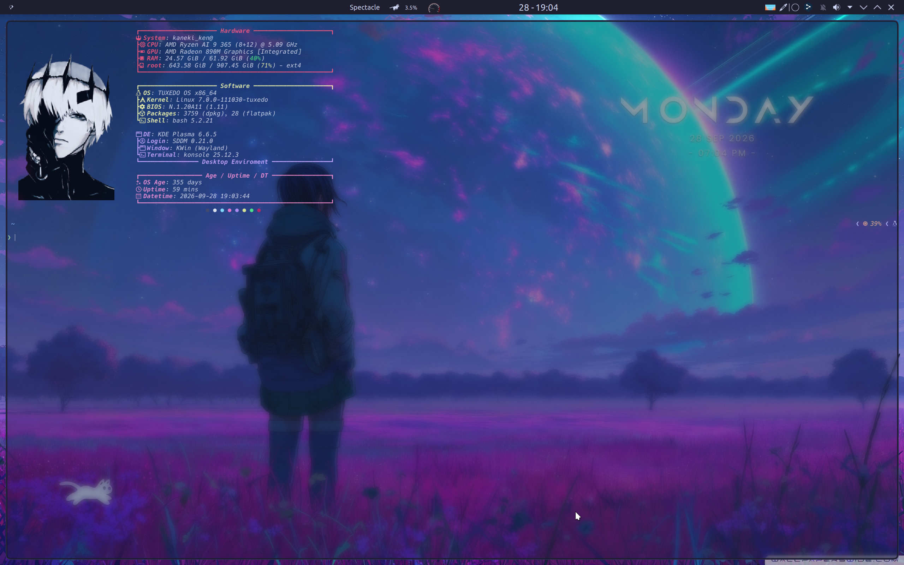
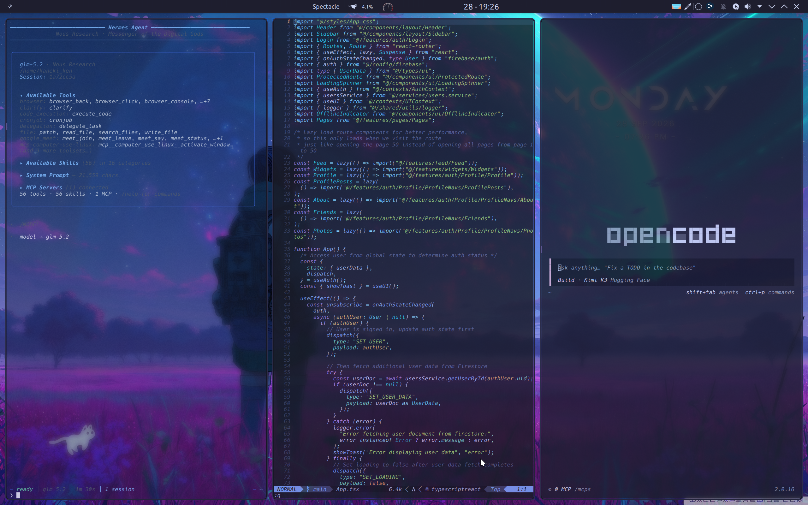
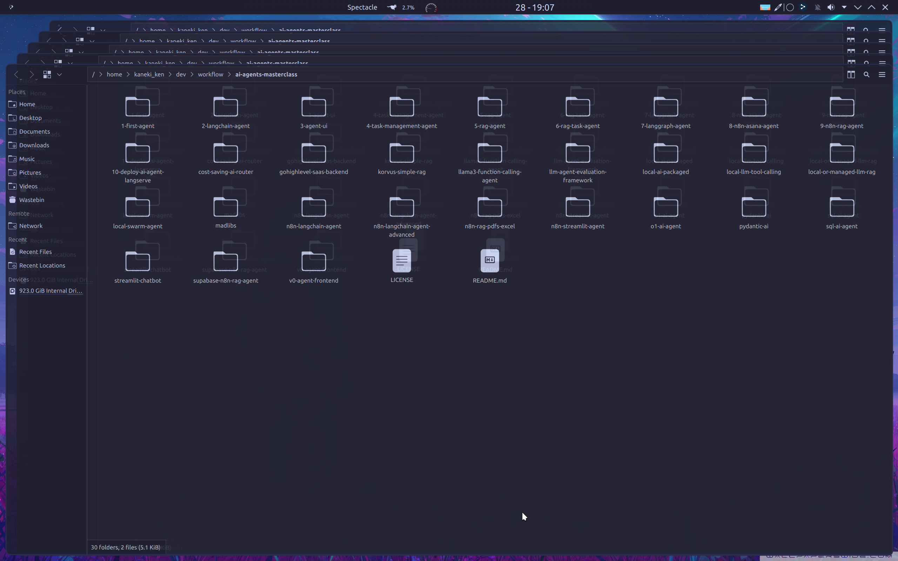
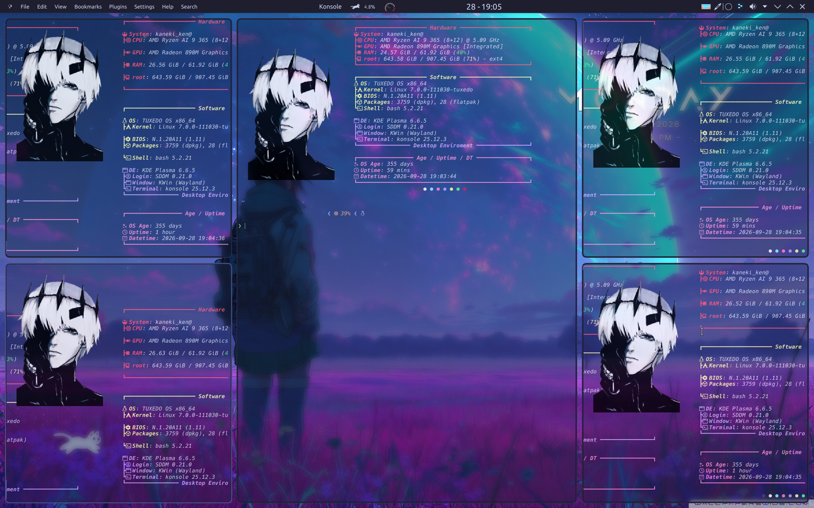
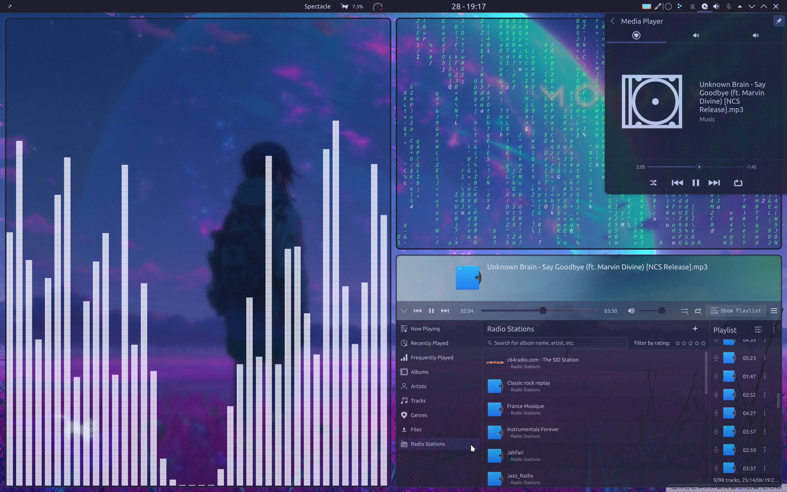
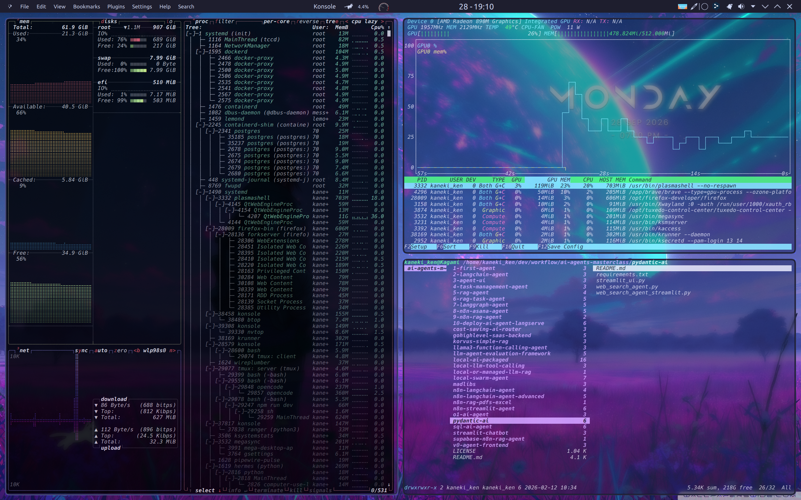

# KDE Plasma Customization Guide

## Overview
This document details my current KDE Plasma setup on Tuxedo OS, featuring Catppuccin Mocha Flamingo theme with various customizations for enhanced productivity and aesthetics.

## 🎨 Theme Configuration

### Wallpaper
- **Source**: [Wallpapers Wide - Sci-Fi Girl Boy Travel](https://wallpaperswide.com/sci_fi_girl_boy_travel_exploring_planet_purple-wallpapers.html)
- **Theme**: Sci-Fi exploration theme with purple accents

### Color Theme
- **Primary**: Catppuccin Mocha Flamingo [KDE Store](https://store.kde.org/p/1921998)
- **Alternative**: Catppuccin Mocha [KDE Store](https://store.kde.org/p/2269981)
- **Usage**: Switch between themes based on mood and lighting conditions

### Window Decoration
- **Current**: Nothing [KDE Store](https://store.kde.org/p/2116663/)
- **Style**: Minimalist borderless design for clean appearance

### Application Style
#### Current Choice: Klassy
- **Source**: [KDE Store - Klassy](https://store.kde.org/s/KDE%20Store/p/2347596)
- **Status**: Successfully installed and currently in use
- **Advantage**: Clean, modern design that integrates perfectly with the overall theme

#### Previous Options
1. **PurPurNight-Kvantum** [KDE Store](https://store.kde.org/p/2255179)
   - *Evaluation*: Colors were too aggressive for daily use
   
2. **Viola-Dark-Kvantum** [KDE Store](https://store.kde.org/p/2162539)
   - *Evaluation*: Good alternative with calm aesthetics and nice widget design

### Icons
- **Theme**: Yet Another Monochrome Icon Set For KDE Plasma
- **Source**: [KDE Store](https://store.kde.org/p/2303161)
- **Style**: Clean, monochrome design that complements the overall aesthetic

### Cursor
- **Theme**: Breeze Light
- **Rationale**: Default KDE cursor with excellent visibility and smooth animations

### Fonts
- **Primary**: JetBrains Nerd Font Mono
- **Usage**: Terminal, code editors, and system fonts
- **Advantage**: Excellent programming font with icon support

## 🖥️ Desktop Effects & Visual Enhancements

### Active KWin Effects
- **Geometry Change** [KDE Store](https://store.kde.org/p/2136283)
- **Slide Back** - Smooth window management
- **Fall Apart** - Creative minimize animation
- **Cube** - 3D desktop switching
- **Better Blur DX** [Github](https://github.com/xarblu/kwin-effects-better-blur-dx) - Enhanced blur effects
- **Wobbly Windows** - Fluid window movement
- **Rounded Corners** [Github](https://github.com/matinlotfali/KDE-Rounded-Corners) - Modern window appearance

### KWin Scripts for Window Management
- **Krohnkite** [KDE Store](https://store.kde.org/p/2144146) - Advanced tiling and window management
- **Full Opacity FullScreen** [KDE Store](https://store.kde.org/p/2316974) - Fullscreen window optimization

## 📱 Widgets & Desktop Components

### Active Widgets
- **Cat Walk** [KDE Store](https://store.kde.org/p/2137844/) - Enhanced desktop navigation
- **Modern Clock** [KDE Store](https://github.com/prayag2/kde_modernclock) - Contemporary time display

## 🪟 Window Management & Rules

### Window Rules Configuration
- **File**: `.kwinrules`
- **Global Rule**: 85% opacity for all windows
- **Purpose**: Creates consistent visual hierarchy and reduces eye strain

### Window Management Tools
- **Application Title Bar** [Github](https://github.com/antroids/application-title-bar?tab=readme-ov-file) - Enhanced window title functionality
- **Global Menu** - Application menu integration

## 🈸 Application Screenshots

### Code Development Environment

### Multi-Window Workflow

### Terminal Setup

### Media Player Integration

### System Statistics

## 🚀 Performance & System Information 

### Hardware Configuration
- **CPU**: AMD Ryzen AI 9 365
- **RAM**: 64 GB
- **GPU**: AMD Radeon 880M (integrated)
- **Storage**: NVMe SSD
- **Display**: 2560x1600 resolution
> I'm using a fraction of my resources to run this ricing in plasmashell, about 2-4.5% cpu, 7-10% gpu and 6GB RAM

### Software Environment
- **Operating System**: Tuxedo OS (Ubuntu-based)
- **Desktop Environment**: KDE Plasma 6
- **Display Server**: Wayland (default)
- **Kernel**: Custom Tuxedo-tuned Linux kernel

## 📝 Configuration Notes

### Customization Philosophy
The setup follows a minimalist approach inspired by [Emmale64](https://www.reddit.com/r/unixporn/s/7Aq3qHu86N)'s design with: 
- Consistent color scheme throughout all applications
- Smooth animations and effects for enhanced user experience
- Productivity-focused window management
- Clean, modern aesthetic with excellent readability

### Theme Consistency
All applications are themed to match the Catppuccin Mocha Flamingo palette:
- Konsole terminal with custom color scheme
- Dolphin file manager with matching icons and colors
- System-wide font consistency using JetBrains Nerd Font Mono

### Performance Considerations
- Effects are optimized for the integrated AMD Radeon 880M GPU
- Window management scripts balance aesthetics with performance
- Global opacity rule reduces GPU load while maintaining visual appeal

---

*Last updated: September 28, 2026*  
*Environment: Tuxedo OS with KDE Plasma 6*